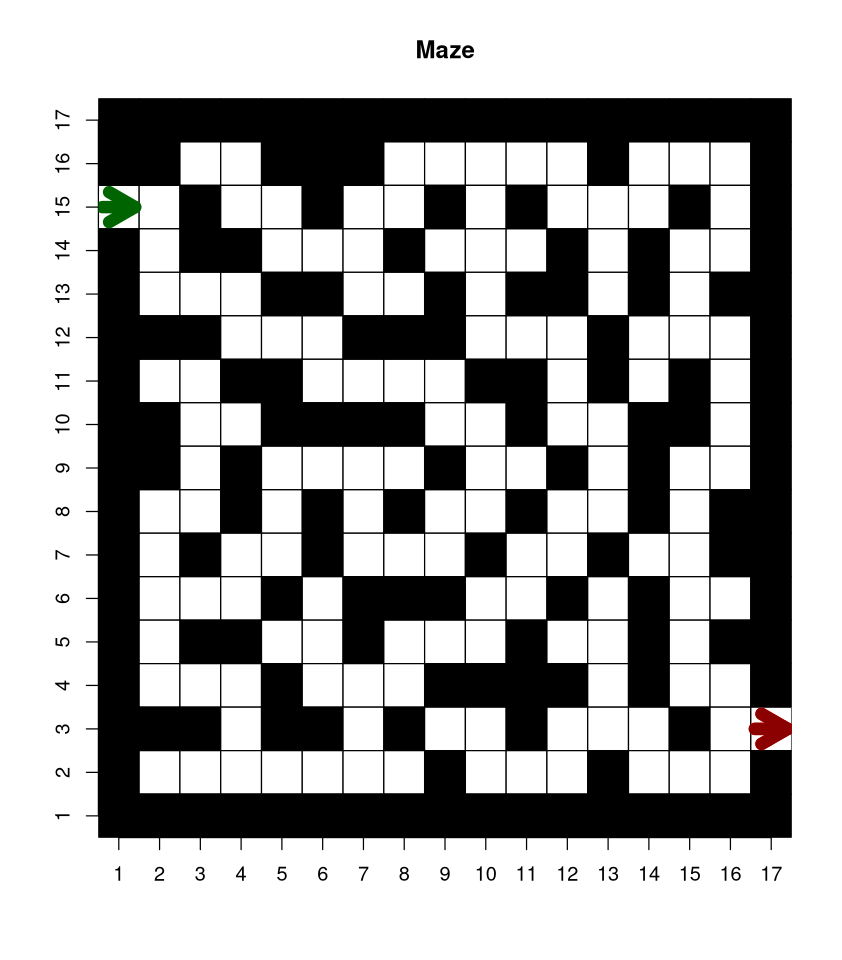
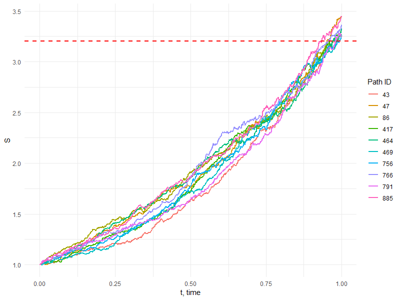

# Homework 2

## Objectives :full_moon_with_face: 
The objectives of this homework assignment are the followings:

- Learn how to program effectively using `if`/`else` and iterations statements;
- Become familiar with using data frame objects and mapping packages;
- Become familiar with GitHub and use it as a collaborative tool.

## Deadline :alarm_clock:

Submit the homework at last by Monday 24th of October 2022 at 23:59pm 
by pushing to the dedicated repository.

## Requirements :warning:

This homework **must** be accomplished using the appropriate GitHub template and respect the following requirements:

- All members of the group must commit at least once.
- All commit messages must be reasonably clear and meaningful.
- Your GitHub repository must include at least the following:
  + One issue containing some form of __TO DO__ list.
  + One pull request followed by a merging.
- Organization (separation of work,...) and progress for your group must appear clearly in __GitHub Projects__.

You can create one or several RMarkdown files to answer the following problems:


## Content :rocket: 

### 1. Easy variance

#### Problem statement

Your boss would like that you analyze some business data. Let $X_1,\dots,X_n$ represents $n$ data points. Suppose you are interested in a statistic, say $\hat{\theta}$. In particular, we consider the mean, the median and the max. You are asked not only to report the statistics, but also an estimator of their variances.

In order to accomplish this task, you will implement the bootstrap. The bootstrap is a well known method in statistics since Efron's seminal paper in 1979. The bootstrap is easy to implement and straightforward to use. There exist many different schemes for the bootstrap, we present the simplest form:

1.  Compute the statistic on the sample: $\hat{\theta} = g(x_1,\dots,x_n)$.
2.  Create a new sample $x_1^\ast,\dots,x_n^\ast$ by drawing data from the original sample **at random with replacement**. This new sample is called a *bootstrapped sample*.
3.  Compute the statistic on the bootstrapped sample: $\hat{\theta}^\ast = g(x_1^\ast,\dots,x_n^\ast)$.
4.  Repeat 2. and 3. $B$ times.
5.  Compute the unbiased estimator of the variance: $$\frac{1}{B-1}\sum_{b=1}(\hat{\theta}^\ast_{b}-\hat{\theta})^2.$$

#### Exercise

1.  Load the dataset `supermarket_sales.csv`. We are interested in the column `Unit.price` and $\hat{\theta}$ is the mean. Using a `for` loop, compute the unbiased estimator of the variance with $B=1'000$.

2.  Propose an alternative solution without any control structure (i.e., no `for` loop, `while` loop, ...). You can for example construct a matrix and use `colMeans()` or `rowMeans()` functions.

3.  Compare the performances of your solutions at 1. and 2. by:

    a\. Profiling your two implementations. Use `profvis::profvis({...})` where `...` is replaced by your code. Comment on the comparison, in particular the memory usage and computation time.  
    b. Benchmarking your two implementations. Use `microbenchmark::microbenchmark({...},{...})` where `...` is to be replaced by your implementations. Comment the results.

4.  Repeat 2. with the median as the statistic of interest. You are still required not use any control structures. There are no `colMedians()` or `rowMedians()` functions. Instead, use the `apply` function. Comment the results in comparison with the mean.

5.  Repeat 1. with the max as the statistic of interest. What do you observe? Comment.


### 2. Customized Emails

#### Problem statement
In this problem, you will write a program to send customized emails automatically. As an illustration, have a look at `example_samuel.html`
and `example_aleksandr.html`.

As we can see, the format of these emails is the same. However, several fill-in information change depending on the recipients. For example, the salutation of each email changes based on the name and gender of the recipient. The described service time in the main text also changes depending on the starting date of service of the recipient. In addition, every email includes a boxplot which is computed based on the service data of each customer. Finally, the email includes some promotion offers which vary based on the age and the amount of phone calls of each customer. These emails are done in an automatic manner in R using control structures. 

The goal of this problem is to write a program, which sends customized emails. The example provided above is about usage of cell phones, and you are welcomed to consider different kinds of professional settings of your choice, such as advertisements or promotions from banks, grocery stores, gyms, etc... 

#### Problem resolution

Once you decide the type of emails, you are asked to do the followings:

1. Create a dataset that contains certain variables of 10 customers (recipients). They can be real or imaginary. Among these variables, **name and email address** must be included. Note that the email addresses you include should be valid email addresses, such as the university emails of the whole group, your personal emails, the ones of your friends, etc... The rest of the variables can be freely of your choice, such as gender, age, nationality, etc... Among the customers, you must include Samuel Orso (ptdshec@gmail.com) and Aleksandr Shemendyuk (aleksandr.shemendyuk@unil.ch). 

2. Create a professional email that you want to send to these customers. The main text of this email should change in **at least 2 places** automatically based on **at least 2 variables** of the customers. This is called reactive text. Moreover, the email should include **at least 1 statistical graph** that is computed based on the data of each customer. You are free to choose the kind of graph that you judge suitable for your email, which can, for example, be histogram, boxplot, bar chart etc... Lastly, at the end of the email, **a GitHub icon (hyperlink)** should be included. By clicking this icon, the recipient should be directed to your GitHub repository of this homework or the Github organization of the class. 

3. By the deadline of this homework, you should send the customized emails to all the customers, including the professor and the TA. Therefore, this problem will be graded not only based on the GitHub repo where all the code should be included, but also based on the final emails we receive, which represent your final output for this problem. 

#### :warning: Please note

Please note that during the development of your program, we ask you to test it with your private email addresses and **NOT on ours**. We will grade all the emails we receive, even if they are sent much earlier than the deadline.😈 Therefore, each group should only send us their emails **once**, at the time of submission of the project.

#### To get started

To get you started about how to send emails from R, we include the script `example.R` that was used to create the emails provided as examples. You can also find more information
[here](https://cran.r-project.org/web/packages/blastula/vignettes/simple_composition.html) and [here](https://rstudio.github.io/blastula/). 


### 3. Can you escape the maze?
For this problem, you will implement a simple algorithm
for finding the exit of a maze, namely, the so-called
*Wall follower*, and its two variants *right-hand rule*
and *left-hand rule*. The idea is quite intuitive:
one always follows the wall on its right-hand 
(or left-hand for the other variant) until an exit point
is found. Interestingly, this approach is guaranteed
to work provided the walls are connected to the maze's
outer boundary. See the illustration below.


1. **Build the maze**. You should obtain exactly the same graph as the following



In order to help you. You should start by loading `maze.rds` which contains binary data: 0 is a wall and 1 is a path.
Using data structure manipulations, construct an appropriate square matrix named `matmaze`, add the outer boundary and the starting and exit points. These points have coordinates:
```{r}
# define starting and final position
starting_pos <- c(15,1)
final_pos <- c(3,17)
```
Make a graph as displayed using, e.g., `plot.matrix::plot()` applied to `matmaze`.

2. **Solve the maze with the right-hand rule**.
We propose the following implementation.
For a given direction, verify that there is a wall on the right.
If not, make a turn right. Is there a wall in front?
If yes, make a turn left. Is there still a wall in front?
If yes, make another turn left. Move one step in that direction.

In order to help you, here is an abstract of the code
you may want to use.
```{r}
# Solving the maze with right hand wall follower
pos <- starting_pos # start with the starting position
direction <- "right" # initial direction
iteration <- 1 #
time_delay <- 1
while(any(pos != final_pos)){
  # 1. Find the direction
  # wall on the right hand?
  wall_right <- switch(direction,
                       right = ...,
                       down = ...,
                       left = ...,
                       up = ...)
  
  # if not, make a turn right
  if(!wall_right){
    direction <- switch(direction,
                        right = "down",
                        down = "left",
                        left = "up",
                        up = "right")
  }
  
  # wall in front?
  wall_front <- switch(...)
  
  # if true, make one turn left
  if(wall_front){
    ...
  }
  
  # wall in front?
  ...
 
  # if true, make one turn left
  ...
  
  # 2. Move one step in the direction
  pos <- ...
  
  # Print the iteration in the graph
  text(x = pos[2], y = pos[1], labels = iteration, cex = 1, col ="blue4")
  Sys.sleep(time_delay)
  iteration = iteration+1
}
```

Are you able to exit the maze? How many iteration does it take?
Make a GIF showcasing your solution.

3. Same as 2. but with the *left-hand* variant. Which
of the two variants is the fastest? 

4. Propose one modification of the maze that 
prevents both variants of succeeding (they never reach the exit).
Can you guess what is the underlying assumption for
the algorithm to work? Discuss it.


### 4. Hitting the target price

#### Problem statement

Let a stock price at time $t$ be $S(t) \equiv S_t$. Assume that $S(t)$ follows 
a __Geometric Brownian Motion__ (GBM) given by:

$$\mathrm{d}S_t = r S_t \mathrm{d}t  + \sigma S_t \mathrm{d}W_t, \quad 0 < t < 1,$$

where $S(0) = 1$, $r$ is a percentage drift,
$\sigma$ is a percentage volatility,
and $W_t$ is a Brownian motion.

Imagine that a company owns a stock whose price follows the above mentioned GMB. 
The company wants to estimate the probability that the stock price reaches a certain level $u > S_0$ 
at the _decision time_ $T = 1$. To do so, the company decides to run $N$ Monte-Carlo simulations to estimate the probability

$$\mathbb{P}(S_T \geq u) = \frac{1}{N} \sum_{k = 1}^N \mathbb{I}(S_T^{(k)} \geq u),$$

where $\mathbb{I}(\cdot)$ is the indicator function, and $S_T^{(k)}$ is the $k$-th simulation of the stock price according to the GBM equation.

To simulate one path of the GBM one can use
the Euler-Maruyama discretization method with a constant temporal step $\tau$:

$$S_{m+1} = S_m + r S_m \tau + \sigma S_m \Delta W_m, \quad S_0 = 1,$$

where $\Delta W_m$ are i.i.d. centred normally distributed random variables
with zeroth mean and variance $\tau$, $m = 0, 1, 2, \ldots, N_t - 1$,
$N_t = \text{ceiling}(1/\tau) + 1$ is the number of temporal steps
at which the values $S_m$ are calculated
(including $0$ and the first temporal step that exceeds $1$, if necessary).


#### Objectives

For the following parameters

|Parameter|Value|
|---|---|
|$T$|1|
|$r$|1|
|$\sigma$|0.1|
|$\tau$|0.001|
|$S_0$|1|
|$u$|3.2|
|$N$|100 000|

- **(a)** Simulate $N$ paths of the stock price $S(t)$ using the Euler-Maruyama method.
Plot some of these paths and comment on them. Do you think this model reflect what you could observe on the stock market? What features seem striking?

- **(b)** Calculate the Monte-Carlo estimate of the probability that the stock exceeds the target price $u$.

- **\(c)** Compare the obtained estimate with the theoretical value of the transformed random variable $\ln(S_T/S_0)$, see [Wiki](https://en.wikipedia.org/wiki/Geometric_Brownian_motion#Solving_the_SDE):

$$\mathbb{P}(S_T \geq u) = 1 - \mathcal{F}_{\ln(S_T/S_0)}(\tilde{u}),$$

where $\tilde{u} = \ln(u/S_0)$, $\mathcal{F}$ is the __Cumulative Density Function__ (CDF) of a normal random variable with mean $(r - \frac{\sigma^2}{2}) T$ and variance $\sigma^2$.

- **(d)** Randomly select $10$ paths $S_t$, which exceed the threshold $u$ (i.e. such that $S_T \geq u$) and plot their evolution over time. Also, add the red dashed horizontal line that represents the target price $u$. You graph should look similar to this one:



